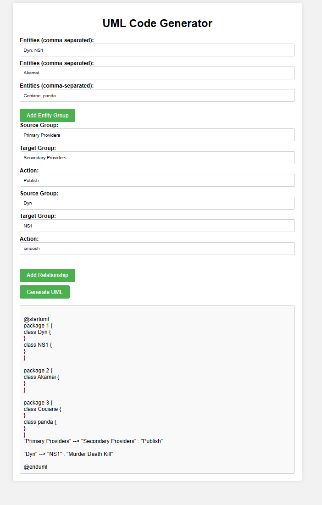

# UML Studio

UML Studio is a web application built with Flask that allows you to generate UML diagrams based on the entities and relationships you define. You can specify groups of entities and their relationships, and the application will generate UML code that can be used to create diagrams.

## Getting Started

To run the UML Studio application locally, follow these steps:

### Prerequisites

- Python 3.x
- Flask

### Installation

1. Clone this repository:

2. Navigate to the project directory:

3. Install dependencies:

pip install -r requirements.txt

### Running the Application

1. Run the Flask application:

python umlstudio.py

2. Open a web browser and go to [http://localhost:5000](http://localhost:5000)

3. Use the web interface to define your entities and relationships, then click "Generate UML" to generate the UML code.

## Running with Gunicorn

You can also run the Flask application with Gunicorn for production deployment. Follow these steps:

Install Gunicorn:

pip install gunicorn

Navigate to the project directory:
cd umlstudio
Run the Flask application with Gunicorn:
gunicorn -w 4 -b 0.0.0.0:5000 umlstudio:app

Open a web browser and go to http://localhost:5000

### Docker

Alternatively, you can run the application using Docker. To do so, follow these steps:

1. Build the Docker image:

docker build -t umlstudio

2. Run the Docker container:

docker run -p 5000:5000 umlstudio

3. Open a web browser and go to [http://localhost:5000](http://localhost:5000)

## Usage

- Define your entities by entering their names and grouping them together.
- Specify relationships between entities and optionally provide actions for each relationship.
- Click "Generate UML" to generate the UML code based on your input.

## License

This project is licensed under the MIT License - see the [LICENSE](LICENSE) file for details.

